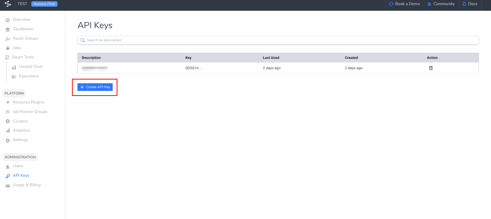
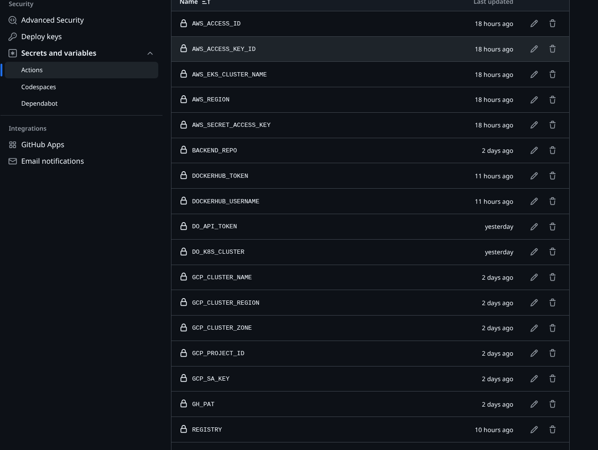
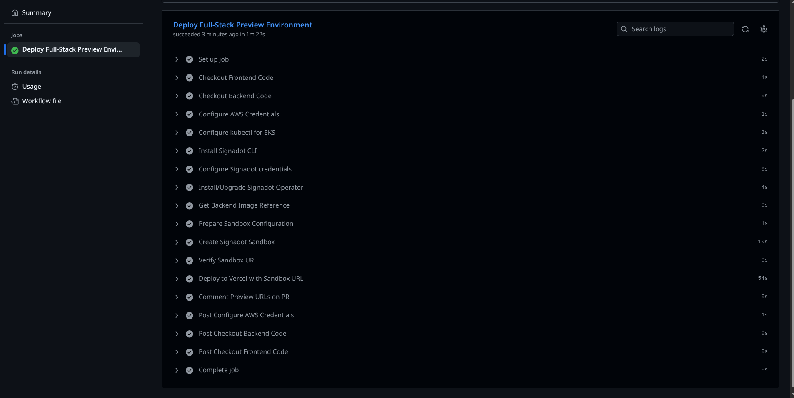
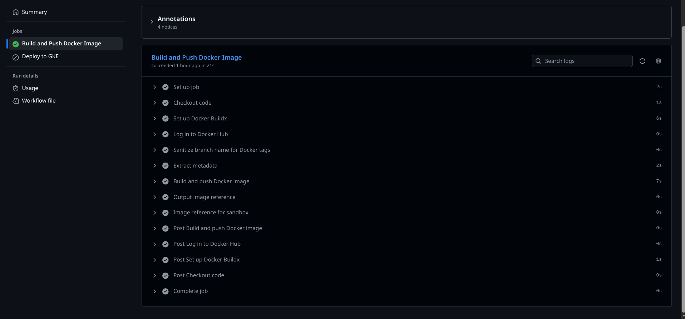
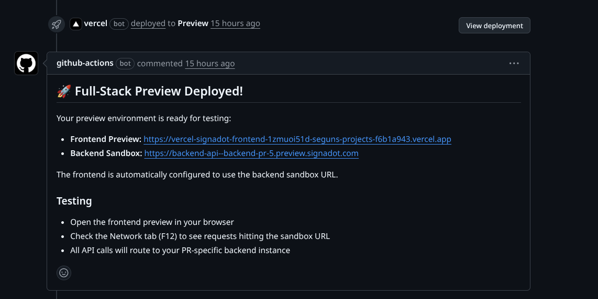
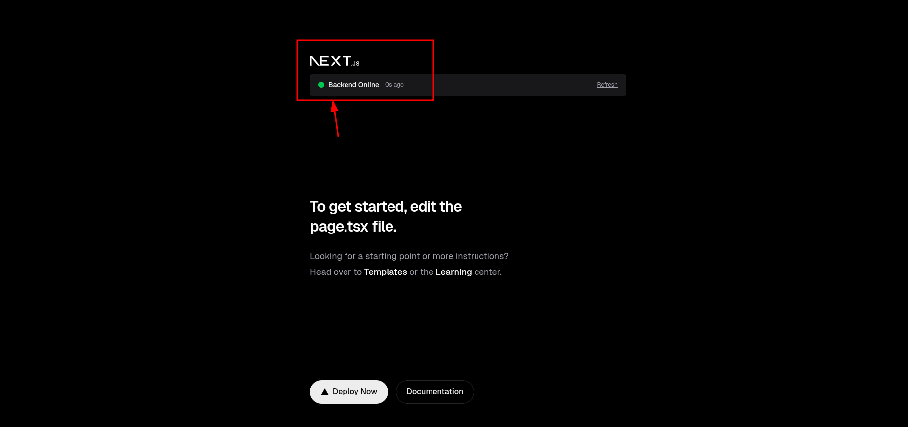

# Tutorial: Connect Vercel Previews to Signadot Sandboxes for Full-Stack Preview Environments

**Goal:** Show a Vercel-hosted frontend preview dynamically connecting to a Signadot sandbox backend that mirrors the changes under review.

Modern Vercel Preview Deployments rarely track backend changes. When a frontend pull request (PR) depends on a backend update, reviewers end up testing against stale APIs.

This guide demonstrates how to:

1. Build an independently deployable backend service that can be cloned for each PR.
2. Configure a frontend (Next.js in this tutorial, though any framework with build-time env support works) to read the backend URL from an environment variable and secure API proxy.
3. Use GitHub Actions to automatically create Signadot sandboxes and deploy Vercel previews.
4. Validate that every frontend PR talks only to its matching backend instance.

**Time required:** 45–60 minutes  
**Repository:** https://github.com/signadot/examples/tree/main/vercel-preview-signadot-sandoxes-cicd-connection

> **Stack note:** The sample code uses a Next.js frontend and a Node/Express backend, but the workflow applies to any framework that can read build-time environment variables and expose a stable Kubernetes deployment for Signadot to clone.

---

## 1. Introduction

### The Problem

- Vercel previews expose frontend changes, but they usually point to a static staging/production backend.
- When PRs span frontend + backend changes, reviewers test UI features against outdated APIs.
- If a backend change breaks staging, every frontend PR fails—even when the frontend code is correct.

### The Solution

- For each frontend PR, create a dedicated Signadot sandbox that clones the backend deployment and overrides it with the image built from that PR/branch.
- Inject the sandbox URL into the Next.js build via `NEXT_PUBLIC_API_URL`.
- Route sandbox-bound requests through a server-side API proxy to keep the Signadot API key private.
- Comment on the PR with both frontend and backend URLs so reviewers can validate the feature end-to-end.

**What you get:** true full-stack preview environments—every pull request spins up both frontend and backend changes automatically.

---

## 2. Prerequisites

| Requirement | Description |
|-------------|-------------|
| GitHub repositories | Separate frontend (`next.js`) and backend (`express`) repos, or a monorepo |
| Vercel account | Project wired to the frontend repo, API token for GitHub Actions |
| Signadot account | Organization name, API key, access to a Kubernetes cluster with the Signadot Operator installed |
| Kubernetes cluster | AWS EKS or GKE Standard (Operator does **not** run on GKE Autopilot) |
| Container registry | Docker Hub / GHCR / GCR for pushing backend images |

> **Tip:** Ensure the Signadot Operator is installed ahead of time. The frontend workflow only verifies the operator; it does not install it by default.

---

## 3. Step 1 – Configure the Application

### 3.1 Backend: Sandbox-ready Deployment

The backend (`backend/`) is a minimal Express server with Kubernetes manifests under `k8s/`.

#### 1. Update the base image reference

`k8s/deployment.yaml`

```yaml
containers:
  - name: vercel-signadot-backend
    image: YOUR_REGISTRY/vercel-signadot-backend:latest
```

Replace `YOUR_REGISTRY` with your registry namespace (e.g., `docker.io/username`) and deploy:

```bash
kubectl apply -f k8s/deployment.yaml
kubectl apply -f k8s/service.yaml
kubectl get deployment vercel-signadot-backend -n default
```

#### 2. Configure `backend/sandbox.yaml`

This file defines how Signadot clones the baseline deployment and overrides the image for a PR-specific sandbox.

```yaml
name: backend-pr-PR_NUMBER
workloads:
  - name: vercel-signadot-backend
    source:
      kind: kubernetes
      name: vercel-signadot-backend
    patches:
      - op: replace
        path: spec/template/spec/containers/0/image
        value: docker.io/DOCKERHUB_USERNAME/vercel-signadot-backend:SANDBOX_IMAGE_TAG
defaultRouteGroup:
  endpoints:
    - name: backend-api
      port: 8080
```

Key callouts:

- `name:` is overwritten with a PR-specific identifier (e.g., `backend-pr-42`).
- `value:` is replaced with the real image reference (e.g., `docker.io/alice/vercel-signadot-backend:branch-sha`).
- `defaultRouteGroup` is mandatory; it creates URLs like `https://backend-api--backend-pr-42.sb.signadot.com`.

#### 3. Validate locally (optional)

```bash
cd backend
npm install
npm run dev
curl http://localhost:8080/health
```

This helps confirm the server responds before deploying.

---

### 3.2 Frontend: Consume `NEXT_PUBLIC_API_URL`

The frontend (Next.js 13+) reads its backend URL from `NEXT_PUBLIC_API_URL`.

#### `src/lib/config/api.ts`

```typescript
const API_URL = process.env.NEXT_PUBLIC_API_URL ?? 'http://localhost:8080';

export function isSignadotUrl(url: string = API_URL): boolean {
  return url.includes('.preview.signadot.com') || url.includes('.sb.signadot.com');
}

export function getApiUrl(endpoint: string): string {
  const path = endpoint.startsWith('/') ? endpoint.slice(1) : endpoint;
  if (isSignadotUrl()) {
    return `/api/proxy/${path}`;
  }
  const base = API_URL.endsWith('/') ? API_URL.slice(0, -1) : API_URL;
  return `${base}/${path}`;
}

export function getApiHeaders(): Record<string, string> {
  return isSignadotUrl() ? {} : { 'content-type': 'application/json' };
}
```

#### `src/app/api/proxy/[...path]/route.ts`

This Next.js route keeps the Signadot API key server-side:

```typescript
export async function GET(request: NextRequest, { params }: Params) {
  const url = `${process.env.NEXT_PUBLIC_API_URL}/${params.path.join('/')}`;

  const response = await fetch(url, {
    headers: {
      'signadot-api-key': process.env.SIGNADOT_API_KEY ?? '',
      accept: 'application/json'
    },
    cache: 'no-store'
  });

  return new NextResponse(response.body, {
    status: response.status,
    headers: response.headers
  });
}
```

All sandbox requests go through `/api/proxy/*`, so the `SIGNADOT_API_KEY` is never exposed in client-side bundles.

#### Example component usage

```typescript
const res = await fetch(getApiUrl('/health'), { headers: getApiHeaders() });
const data = await res.json();
```

---

## 4. Step 2 – Create the GitHub Workflows

### 4.1 Backend CI (`backend/.github/workflows/ci.yml`)

Purpose: build, tag, and push backend Docker images so sandboxes can pull PR-specific artifacts.

Highlights:

- Logs into `REGISTRY` with `DOCKERHUB_USERNAME`/`DOCKERHUB_TOKEN`.
- Tags images with `branch-sha`, short SHA, and `latest` on default branch.
- Optional `deploy-to-eks` job updates the baseline deployment on `main`/`master`.

```yaml
name: Build and Push Backend Image
on:
  pull_request:
    branches: [main, master]
  push:
    branches: [main, master]

jobs:
  build-and-push:
    steps:
      - uses: actions/checkout@v4
      - uses: docker/setup-buildx-action@v3
      - uses: docker/login-action@v3
        with:
          registry: ${{ env.REGISTRY }}
          username: ${{ env.DOCKERHUB_USERNAME }}
          password: ${{ secrets.DOCKERHUB_TOKEN }}
      - uses: docker/build-push-action@v5
        with:
          push: true
          tags: ${{ steps.meta.outputs.tags }}
```

Secrets required in backend repo:

| Secret | Purpose |
|--------|---------|
| `REGISTRY` | Base registry (e.g., docker.io) |
| `DOCKERHUB_USERNAME` | Registry username |
| `DOCKERHUB_TOKEN` | Registry write token |
| `AWS_*`, `SIGNADOT_CLUSTER_TOKEN` | Only needed if `deploy-to-eks` job is enabled |

---

### 4.2 Frontend Preview Workflow (`frontend/.github/workflows/vercel-preview.yml`)

Triggered on `pull_request`. Major phases:

1. **Checkout** frontend + backend code.
2. **Authenticate to AWS** and configure `kubectl` for the baseline cluster.
3. **Verify Signadot Operator** namespace/pods exist.
4. **Rewrite `backend/sandbox.yaml`** (cluster, image, sandbox name).
5. **Create Signadot sandbox** and extract the `backend-api` URL.
6. **Deploy to Vercel** with `NEXT_PUBLIC_API_URL` set to the sandbox endpoint.
7. **Comment on PR** with frontend + backend URLs.

Key excerpt:

```yaml
- name: Prepare Sandbox Configuration
  run: |
    IMAGE_REF=${{ steps.backend-image.outputs.IMAGE_REF }}
    sed -i "s|cluster:.*|cluster: ${{ secrets.AWS_EKS_CLUSTER_NAME }}|g" backend/sandbox.yaml
    sed -i "s|image:.*vercel-signadot-backend.*|image: ${IMAGE_REF}|g" backend/sandbox.yaml

- name: Create Signadot Sandbox
  id: sandbox
  run: |
    SANDBOX_NAME="backend-pr-${{ github.event.number }}"
    sed -i "s|backend-pr-PR_NUMBER|${SANDBOX_NAME}|g" backend/sandbox.yaml
    signadot sandbox apply -f backend/sandbox.yaml
    SANDBOX_URL=$(signadot sandbox get "${SANDBOX_NAME}" -o json | jq -r '.endpoints[] | select(.name=="backend-api").url')
    echo "sandbox-url=${SANDBOX_URL}" >> "$GITHUB_OUTPUT"

- name: Deploy to Vercel
  uses: amondnet/vercel-action@v25
  with:
    vercel-args: '--build-env NEXT_PUBLIC_API_URL=${{ steps.sandbox.outputs.sandbox-url }} --env SIGNADOT_API_KEY=${{ secrets.SIGNADOT_API_KEY }} --force'
```

Secrets required in frontend repo:

| Category | Secrets |
|----------|---------|
| Vercel | `VERCEL_TOKEN`, `VERCEL_ORG_ID`, `VERCEL_PROJECT_ID` |
| Signadot | `SIGNADOT_API_KEY`, `SIGNADOT_ORG` |
| GitHub | `BACKEND_REPO`, `GH_PAT` (to checkout backend repo) |
| AWS | `AWS_ACCESS_KEY_ID`, `AWS_SECRET_ACCESS_KEY`, `AWS_REGION`, `AWS_EKS_CLUSTER_NAME` |
| Registry | `DOCKERHUB_USERNAME` (used for image rewrites) |

> **Note:** This workflow uses the Signadot CLI (`signadot sandbox apply/get`). You can substitute `signadot/sandbox-action` if desired; the logic is equivalent.

If you are **not** running the backend CI job with `SIGNADOT_CLUSTER_TOKEN` (which installs the operator automatically), install the Signadot Operator yourself before running this workflow. The commands below are the exact ones the backend workflow executes:

```bash
kubectl create namespace signadot

helm repo add signadot https://charts.signadot.com
helm repo update signadot

kubectl create secret generic cluster-agent \
  --from-literal=token=$SIGNADOT_CLUSTER_TOKEN \
  -n signadot

helm upgrade --install signadot-operator signadot/operator \
  --namespace signadot \
  --wait
```

> You can also enable the optional `deploy-to-eks` job in the backend CI workflow, which runs the same Helm installation when `SIGNADOT_CLUSTER_TOKEN` is provided.

If you need a visual reference for where to retrieve the Signadot API key and how the Vercel project secrets are configured, see the screenshots below:





---

## 5. Step 3 – See It Work

1. **Create a frontend PR.** The workflow triggers automatically.
2. **Observe GitHub Actions:** You should see steps for checking out repos, configuring AWS, creating the sandbox, and deploying to Vercel.  
   
3. **Verify backend pipeline (optional):** The backend CI workflow should have already produced the image tag that the sandbox consumes.  
   
4. **Find the PR comment:** The workflow posts both the frontend preview and backend sandbox URLs.  
   
5. **Open the Vercel preview** and interact with the UI, then inspect the Network tab—you should see calls proxying to `https://backend-api--backend-pr-<n>.sb.signadot.com`.  
   

---

## 6. Troubleshooting

| Issue | Checks |
|-------|--------|
| Sandbox creation fails | `kubectl get deployment vercel-signadot-backend -n default`, `kubectl get pods -n signadot`, confirm image exists in registry |
| API calls from Vercel fail | Ensure `NEXT_PUBLIC_API_URL` is in build logs, `SIGNADOT_API_KEY` is set (no `NEXT_PUBLIC_`), `/api/proxy/[...path]` exists |
| 401/403 from sandbox | Requests must go through the proxy so the `signadot-api-key` header is added server-side |
| AWS auth errors | Verify `AWS_EKS_CLUSTER_NAME` and `AWS_REGION` secrets; IAM needs `eks:DescribeCluster` |

To debug locally:

```bash
curl https://<vercel-preview>.vercel.app/api/proxy/health \
  -H "signadot-api-key: $SIGNADOT_API_KEY"
```

---

## 7. Conclusion

By pairing Vercel previews with Signadot sandboxes, you achieve:

- Full-stack parity for every PR.
- Automatic orchestration via GitHub Actions.
- Repeatable environments reviewers can trust.

Clone this repository, customize the placeholders, and your team will have dependable full-stack previews in under an hour.

### Additional Resources

- [Signadot Documentation](https://www.signadot.com/docs)
- [Vercel Preview Deployments](https://vercel.com/docs/deployments/preview-deployments)
- [GitHub Actions Documentation](https://docs.github.com/en/actions)
